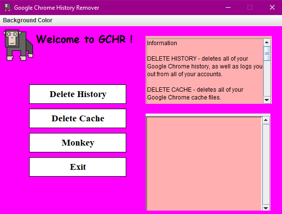

DELETE HISTORY - deletes all of your Google Chrome history, as well as logs you out from all of your accounts.

DELETE CACHE - deletes all of your Google Chrome cache files.

Don't worry, because once you log back in your Google Account, you will most likely get all of your lost history back, because Google synchronizes it all into a cloud.

Why you should delete cache files? To ensure that your browser is functioning efficiently, as an overloaded cache could be slowing down your browser experience.

^.^
